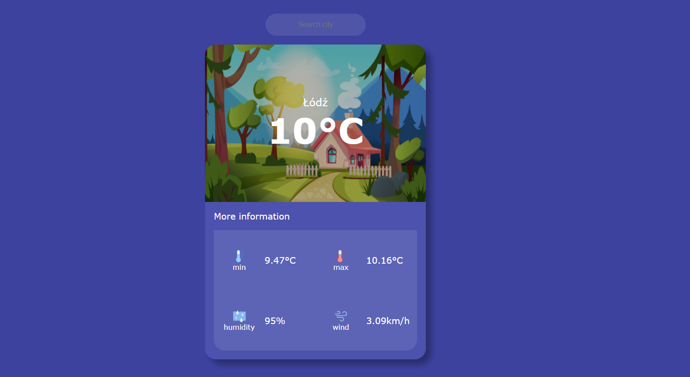
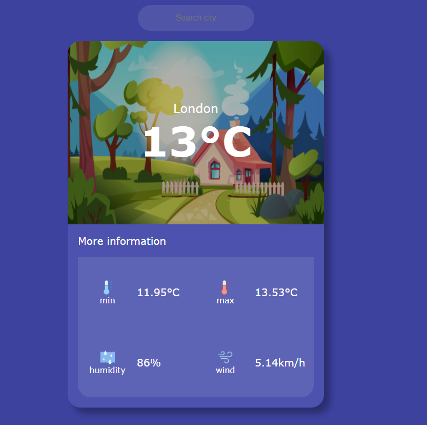
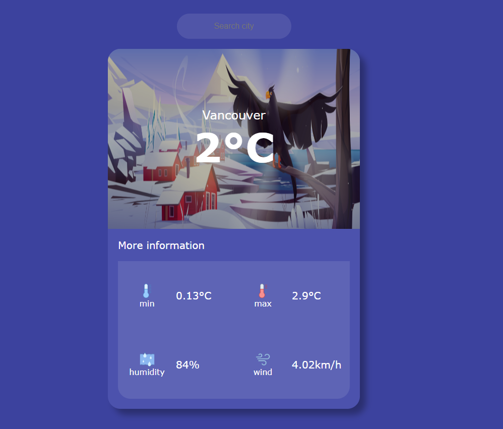

# WeatherApp

This project was generated with [Angular CLI](https://github.com/angular/angular-cli) version 14.2.8 and using the [RapidWeather API](https://rapidapi.com/standingapi-standingapi-default/api/rapidweather/)

## Development server

Run `ng serve` for a dev server. Navigate to `http://localhost:4200/`. The application will automatically reload if you change any of the source files.

## Main View
When the application is launched, the main view appears, along with the weather for the default city. For me it is Lodz, Poland

## Searching

After entering the city of interest in the search engine and confirming by clicking ENTER, the application will display the current weather in the selected city. Depending on the temperature it will be different

### For temperatures above 6°C

### For temperatures below 6°

